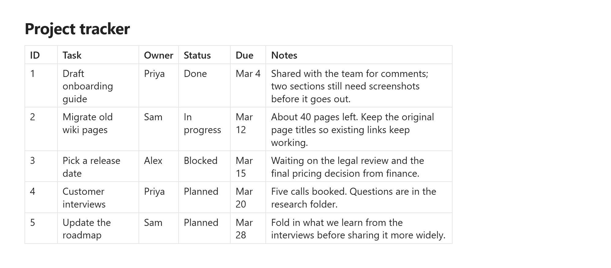
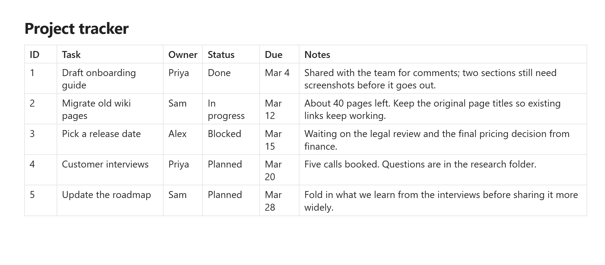

# Gridlock Tables

Gridlock Tables makes Markdown tables easier to read and arrange. Columns size
to what's in them, a wide table uses the space your pane actually has, and when
you drag a column to a width you like, it stays that way.

It works in Reading view and Live Preview.

**Default table**



**With Gridlock Tables**



## Why I made this

I keep a lot of notes in tables, and I missed how tables behave in OneNote: a
short column stays short, a long one wraps, and you can grab a column edge and
set the width yourself. Obsidian's tables are clean and simple, and I wanted to
keep that while adding a little more control. Gridlock leaves your Markdown as
ordinary Markdown and only changes how the table is laid out.

| | Default tables | With Gridlock |
|---|---|---|
| Column widths | Set automatically by the layout | Sized to their content, within a minimum and maximum you choose |
| Wide tables | Stay within the readable line width and scroll sideways inside it | Grow into the free space in the pane, and scroll sideways only when they run out of room |
| Resizing a column | Not available | Drag a column edge, or double-click it to fit the content |
| Remembering widths | Not available | Saved with the note, so they survive renames, moves and sync |
| Look and feel | Follows your theme | Follows your theme, with optional font, size and spacing controls through Style Settings |

## Using it

Install the plugin and your tables pick up the new layout straight away. There
is nothing to set up unless you want to.

- **Resize a column**: hover over a column edge until the cursor changes, then
  drag. With a mouse this works from any row. On a touch screen, drag the
  handle in the header row.
- **Fit a column to its content**: double-click (or double-tap) the column
  edge.
- **Go back to automatic widths**: delete the width comment above the table
  (see below).

### Where resized widths are saved

When you resize a column, Gridlock writes the widths into the note as an HTML
comment above the table, followed by a blank line:

```markdown
<!-- gridlock-cols: 12ch auto 40ch -->

| Col A | Col B | Col C |
```

There is one value per column: a width in characters (`ch`), or `auto` for a
column that sizes to its content. Other Markdown apps ignore the comment, so
your notes stay portable and the widths travel with the note. Live Preview
hides the comment until your cursor is on it; Source mode always shows it.

If you'd rather keep your Markdown untouched, set **Save column widths** to
**In plugin data**, and widths are stored in the plugin's own data instead.

### Turning it off for one note

Add the `gridlock-tables-off` CSS class to a note's properties and its tables
render normally, while the plugin keeps working everywhere else:

```yaml
---
cssclasses: [gridlock-tables-off]
---
```

## Settings

- **Enable plugin**: turn Gridlock off everywhere without uninstalling it.
- **Minimum column width** / **Maximum column width** (4 to 120 characters,
  defaults 6 and 60): a short column never shrinks to a sliver, and a column of
  long text wraps instead of taking over the table.
- **Save column widths**: **In the note** (default) or **In plugin data**.
- **Hide width comments in Live Preview** (default on): turn this off if you'd
  rather see the width comment while you edit.

### Style Settings

If you use the [Style Settings](https://github.com/mgmeyers/obsidian-style-settings)
plugin, a **Gridlock Tables** section lets you change the table font, header
font, text size, header text size, header weight, line height, and cell
padding. Anything you leave alone keeps following your theme.

## Installing

In Obsidian, open **Settings → Community plugins → Browse**, search for
**Gridlock Tables**, then install and enable it.

Gridlock needs Obsidian 1.14.4 or newer.

## Feedback

Found a bug or have an idea? Please
[open an issue](https://github.com/mshish/gridlock-tables/issues).

## Development

```sh
npm install
npm run dev     # watch build to main.js
npm run build   # typecheck + production build
npm run lint
npm test
```

Design notes and the reasoning behind the layout are in
[`docs/research/feasibility.md`](docs/research/feasibility.md).

## License

MIT
